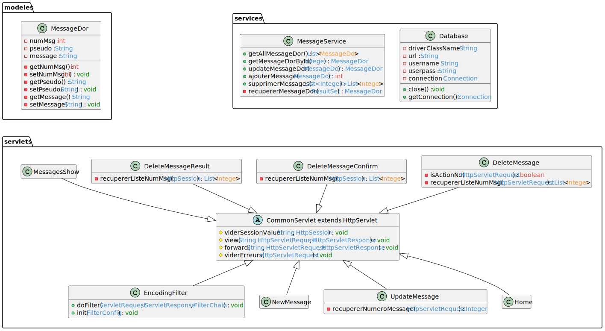

# Le livre d'or
## Contexte
L'objectif de ce projet était de représenter un Livre d'or avec une application en Servlets.

La persistence des données est faite via une base de données. Cette BD est source des différents messages reçus.

## Fonctionnalités
- Affichage des messages
- Création de messages
- Modification de message
- Suppressions de messages

## Diagramme de classes
